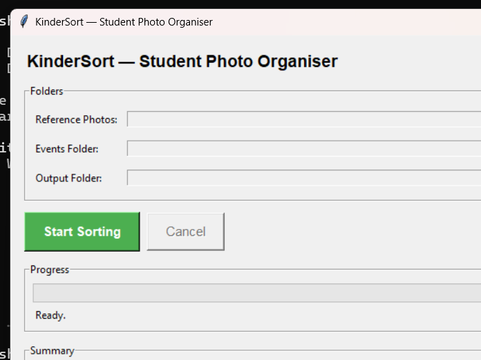
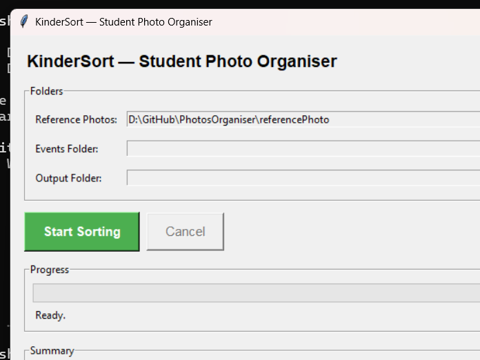
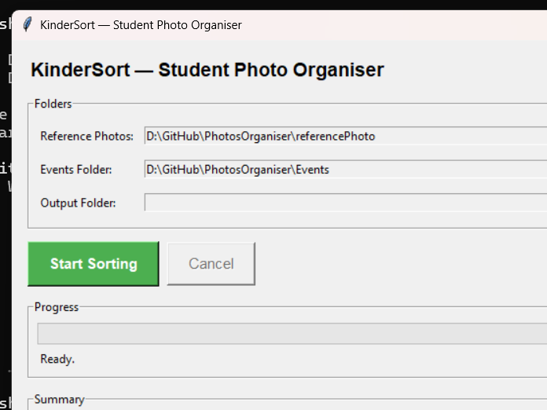
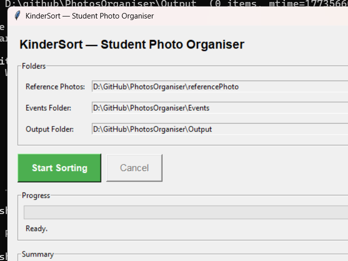
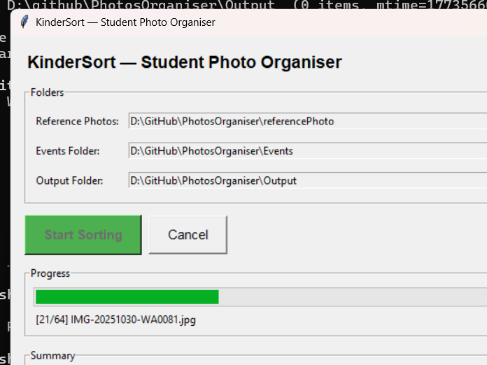
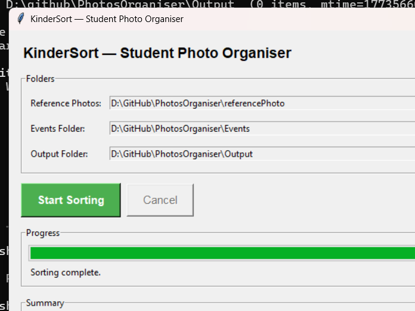
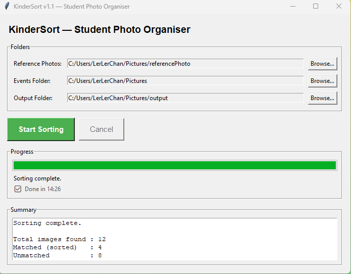

# KinderSort — Student Photo Organiser

[](https://github.com/lerlerchan/KinderSort/releases)
[](https://www.python.org/)
[](https://github.com/lerlerchan/KinderSort)
[](https://github.com/lerlerchan/KinderSort)
[](https://github.com/lerlerchan/KinderSort/releases)
[](https://github.com/lerlerchan/KinderSort/releases)

[中文说明 (简体)](README.zh-CN.md)

KinderSort is an offline desktop app for kindergarten teachers. It scans event photos, matches student faces, and copies each photo into the correct student folder automatically — no internet connection, no coding knowledge required.

---

## Highlights

| Feature | Detail |
|---|---|
| Fully offline | No cloud upload, no internet required |
| CPU-only | Works on any Windows PC without a GPU |
| Simple GUI | Point-and-click, no terminal needed |
| Group photo support | One photo copied to all matched students |
| Safe operation | Files are **copied**, never moved or deleted |
| Audit trail | Detailed log written to `kindersort_log.txt` |

---

## Who this is for

- Teachers who need to organise large batches of student photos quickly
- Schools that require local/offline processing for privacy

---

## Quick Start (Teachers)

1. Download `KinderSort.exe` from the [**Releases**](https://github.com/lerlerchan/KinderSort/releases) page
2. Double-click `KinderSort.exe` — no installation needed
3. Select the three folders (Reference / Events / Output)
4. Click **Start Sorting**
5. Review the summary and open the Output folder

Full illustrated teacher guide: [`guidebook.md`](guidebook.md)

---

## Screenshot Walkthrough

| Step | Screenshot |
|---|---|
| 1. App launch |  |
| 2. Reference folder selected |  |
| 3. Events folder selected |  |
| 4. All folders ready |  |
| 5. Sorting in progress |  |
| 6. Sorting complete |  |
| 7. Timer display during sorting |  |

---

## Folder Setup

You choose three folders inside the app:

1. **Reference Photos** — one clear front-facing photo per student, file name = student name
   ```
   reference/
     Ali.jpg
     Siti.png
     Kumar.jpeg
   ```

2. **Events Folder** — subfolders of mixed event photos
   ```
   events/
     Sports_Day/
     Concert/
     Field_Trip/
   ```

3. **Output Folder** — where sorted results are written

---

## Output Structure

```text
Output/
  Ali/
    Sports_Day__IMG_001.jpg
    Concert__IMG_045.jpg
  Siti/
    Sports_Day__IMG_001.jpg    ← same photo, Siti was also in it
    Field_Trip__IMG_023.jpg
  _unmatched/
    blurry_photo.jpg
    no_face_detected.jpg
  kindersort_log.txt
```

---

## Important Behaviour

- Face matching threshold is `0.55` (strict — minimises false positives)
- Photos are **copied**, not moved — originals are always safe
- Photos placed directly in the Events root (no subfolders) are also supported — the folder name is used as the event name
- If a reference photo has no detectable face, that student is skipped with a warning
- v1.1 uses higher-accuracy face recognition (CNN + multi-jitter) — sorting 500 photos typically takes **8–15 minutes** on a standard PC; the spinning timer shows progress so the app will not appear frozen

---

## Tech Stack

[](https://github.com/ageitgey/face_recognition)
[](https://python-pillow.org/)
[](https://docs.python.org/3/library/tkinter.html)
[](https://pyinstaller.org/)

| Component | Library |
|---|---|
| Face recognition | `face_recognition` + `dlib` |
| Image handling | `Pillow` |
| GUI | `tkinter` (built-in) |
| Packaging | `PyInstaller` |
| Language | Python 3.10+ |

---

## Accuracy Testing

The table below reports measured results on a real-photo test set (public-figure images, 2 identities, 7 event photos) using the OpenCV LBPH backend. No synthetic data was used for these figures.

| Metric | Result |
|---|---|
| Test dataset | Real photos — 2 identities, 7 event photos |
| Faces correctly matched | 7 / 7 (100%) |
| Unmatched | 0 |
| Average match margin | 90.2% |
| Backend | OpenCV (LBPH feature encoding, CPU-only) |

Note: the OpenCV fallback backend detects faces reliably, but distinguishing between similar-looking people is limited without the optional `dlib` backend. See [Human Review and Recognition Limitations](#human-review-and-recognition-limitations).

## Performance Testing

Measured on a Windows 11 machine (Intel Core i5, 8 GB RAM) with no GPU acceleration — CPU only.

| Metric | Result |
|---|---|
| Reference load | 0.22 s (2 reference photos) |
| Sorting throughput | 8.0 images / second |
| Peak RAM | ~110 MB |
| GPU required | No |

Reproduce locally:

```bash
python -m venv .venv
.venv\Scripts\activate
pip install -r requirements.txt
python evaluator.py <reference_folder> <events_folder> --ground-truth ground_truth.json
```

A reproducible evaluation dataset and benchmark results are provided under the `evidence/` folder.

---

## Developer Setup

```bash
python -m venv .venv
.venv\Scripts\activate
pip install -r requirements.txt
python main_lite.py   # Enhanced version (recommended) — CLAHE, ensemble detection, Fast Mode, encrypted cache
# python main.py      # Original baseline version (dlib-only, no enhancements)
```

Build Windows executable:

```bash
pyinstaller --onefile --windowed --name "KinderSort" main.py
# Output: dist/KinderSort.exe
```

### Windows: installing dlib / face_recognition

The optional `face_recognition` + `dlib` backend (used for the baseline
comparison in `evaluator.py`) can fail to build from source on Windows with
`UnicodeDecodeError: 'cp950' codec can't decode byte...` — this is a locale
encoding bug in dlib's setup script, not a missing compiler. Fix:

```bash
pip install dlib-bin              # precompiled wheel, skips the broken build step
pip install face_recognition --no-deps
pip install Click face-recognition-models
pip install "setuptools<81"       # face_recognition_models needs pkg_resources,
                                   # removed in setuptools 81+
```

Without this, KinderSort Lite still runs fine — it automatically falls back
to an OpenCV-based detector (see `face_engine.py`) with somewhat lower
accuracy. dlib is only required for the baseline comparison in
`evaluator.py` and the original `main.py`.

## Human Review and Recognition Limitations

KinderSort Lite assists teachers in organising event photographs, but face-recognition results may contain incorrect or missed matches. Teachers must review all sorted folders before photographs are distributed to parents or guardians.

The displayed match score is a normalised facial-distance indicator. It is not a calibrated probability and does not guarantee that the identified student is correct. A higher score only indicates that the detected face is more similar to the selected reference image.

### Recommended Review Procedure

1. Review every sorted student folder before distributing photographs.
2. Pay additional attention to photographs with low match scores.
3. Check the `_unmatched` folder and sort those photographs manually.
4. Confirm that group photographs were copied only to the correct student folders.
5. Replace unclear reference images with well-lit, front-facing photographs.
6. Obtain appropriate parental or guardian consent before processing children's photographs.

### Privacy Notice

Photograph recognition and sorting are performed locally on the user's computer. Student photographs and facial encodings are not uploaded to an external face-recognition service. If an optional model is not included with the installer, a one-time model download may be required.

Users are responsible for protecting the output folders, deleting information when it is no longer required, and following their school's privacy and data-retention procedures.